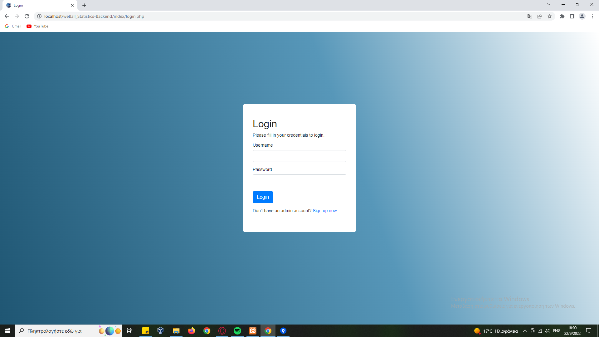
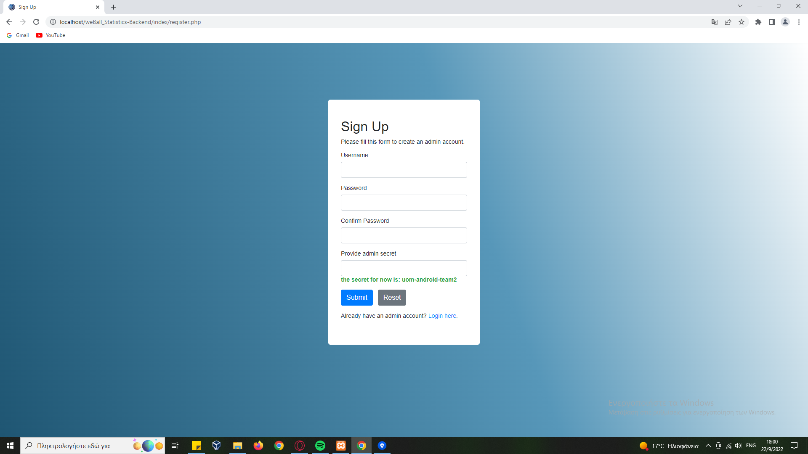
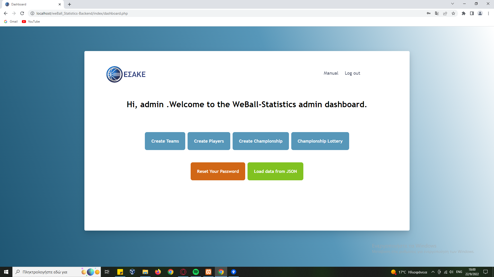
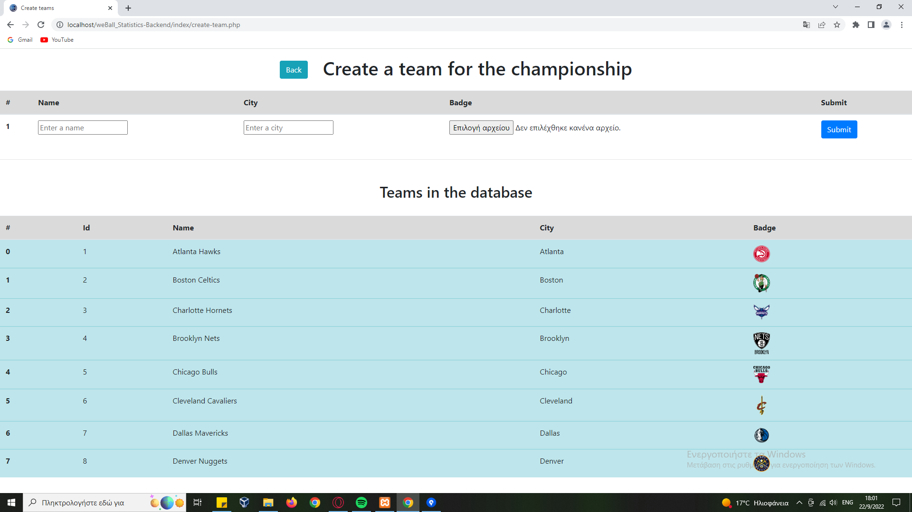
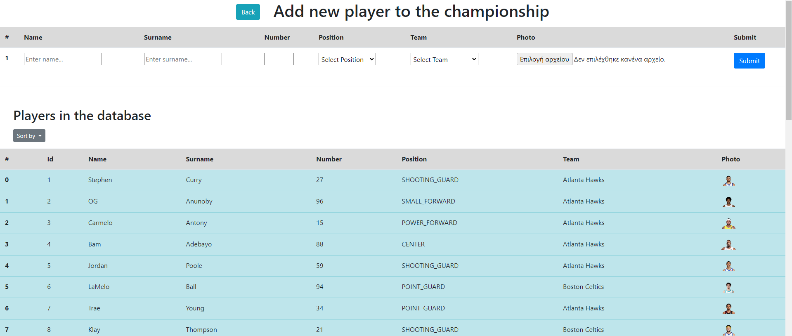
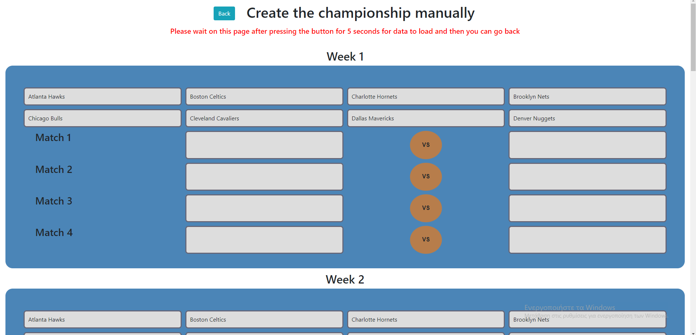
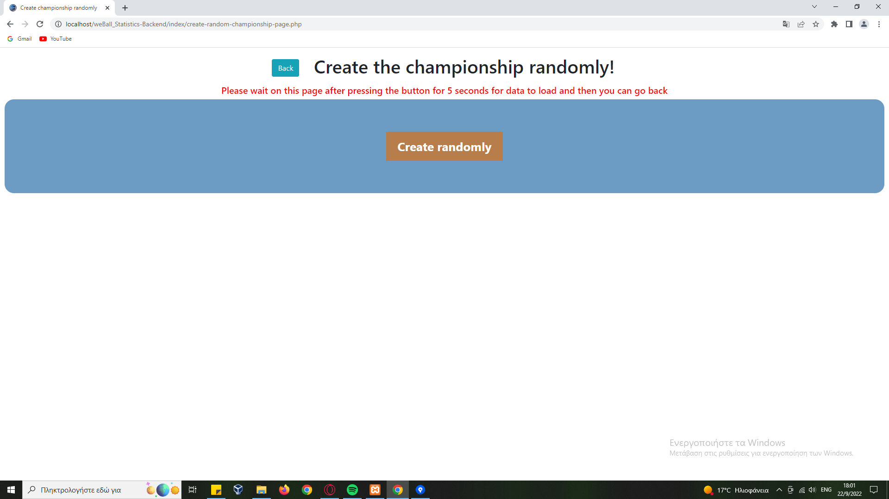
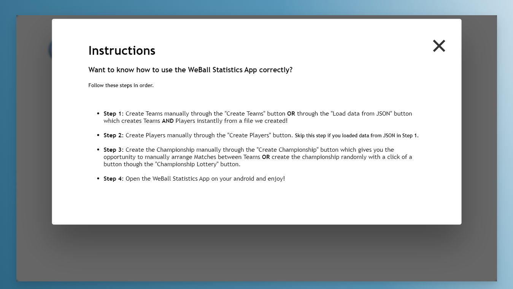

# WeBall Statistics

<h4>The WeBall Statistics application is a league statistics application for basketball, which was created as part of the course "Apps development for Mobile Devices" (University of Macedonia - Applied Informatics, academic year 2021-2022, 6th semester).</h4>
<h4>Part of the course, was to get organized into groups of 10 people. Our team (#Team 2) consists of the following students alphabetically:</h4>
<ul>
  <li><b><i>Ampatzidou Elisavet</i></b></li>
  <li><b><i>Charakopoulos Minas - Theodoros</i></b></li>
  <li><b><i>Dasyra Evmorfia - Elpida </i></b></li>
  <li><b><i>Iordanou Sofia</i></b></li>
  <li><b><i>Lougaris Dionisis </i></b></li>
  <li><b><i>Lousta Aravella</i></b></li>
  <li><b><i>Machairas Panagiotis</i></b></li>
  <li><b><i>Ouzounidis Kyriakos</i></b></li>
  <li><b><i>Pepa Leonard</i></b></li>
  <li><b><i>Stefou George-John</i></b></li>
</ul>

<h4>Video presentation of the app on YouTube: <a href="https://www.youtube.com/watch?v=ouzMwkUCQ-s&list=LL&index=12"><b><i>presentation video</i></b><a/></h4>
<h4>Visit the other repository, with the android mobile application: <a href="https://github.com/uom-android-team2/WeBall_Statistics"><b><i>Android App - Front-End</i></b><a/></h4>
  
# Navigating the app's back-end UI  

<h4>This is the home/index page of the back-end admin UI. From there one can see information about the software that was developed, such as team members, course teachers, etc. Through this page, the admin user has the options to Login or create an account by selecting the appropriate link from the nav bar.</h4>
<hr width="70%">
<br>
<div float="left">
  
  
</div>
<h4>Through the left screen, the admin can login to their account. If he does not have an account, he can create one through the form shown on the right screen.</h4>
<hr width="70%">
<br>

<h4>After successfully logging into his account, he will go to the admin panel. From there he has the following possibilities:</h4>
<ul>
  <li><b><i>Create Team and view a list with all the teams in the MySQL Database</i></b></li>
  <li><b><i>Create Player and view a list with all the players in the MySQL Database</i></b></li>
  <li><b><i>Create league manually for every week</i></b></li>
  <li><b><i></i>Championship draw selection automatically, through our own algorithm.</b></li>
  <li><b><i></i>Reset his password</b></li>
  <li><b><i></i>Load data from json files with ready data for players and teams so he doesn't have to put it all in manually.</b></li>
  <li><b><i>Check the manual</i></b></li>
  <li><b><i>Logout</i></b></li>
</ul>
<hr width="70%">
<br>

<h4>Through this screen he can create teams and see the existing ones.</h4>
<hr width="70%">
<br>

<h4>Through this screen he can create players and see the existing ones.</h4>
<hr width="70%">
<br>

<h4>Through this screen, the admin can create the league matches manually.</h4>
<hr width="70%">
<br>

<h4>Through this screen, the admin can create the league matches automatically by simply pressing the button and waiting 5sec for the process to complete.</h4>
<hr width="70%">
<br>

<h4>This is the last screen, where the admin will find information about managing the admin panel.</h4>

# Prerequisites
<ul>
  <li>Android Studio</li>
  <li>XAMPP Control Panel</li>
  <li>An emulator installed e.g. Nexus 5 API 30, Pixel 3 XL API 29</li>
  <li>Internet Connection</li>
</ul>

# Local Installation
<h4>For the correct use of the application, the following actions are required:</h4>

```
Run at first the back-end:
git clone https://github.com/uom-android-team2/WeBall_Statistics-Backend.git or download the zip from github and extract it
Store or move the root folder WeBall_Statistics-Backend(-master) in <PATH>\xampp\htdocs folder
Open XAMPP Control Panel and start Apache and MySQL servers
Visit from your browser http://localhost/WeBall_Statistics-Backend/index/ then register or login and follow the manual

Now, for the Mobile Application:
git clone https://github.com/uom-android-team2/WeBall_Statistics.git or download the zip from github and extract it
Store or move the root folder WeBall_Statistics(-main) in <PATH>\AndroidStudioProjects\
Open Android Studio and the app root folder.
Config the App:
public static final String IP = <YOUR_IP>  --> (java/uom/team2/weball_statistics/configuration/Config.java)
<domain includeSubdomains="true"><YOUR_IP></domain>  --> (res/xml/network_security_config.xml)
Start any emulator, and then you are ready to launch the app!
```

<h4>Note: Maybe you will see already data for live matches because of the real time cloud service was used, firebase real-time database!</h4>
